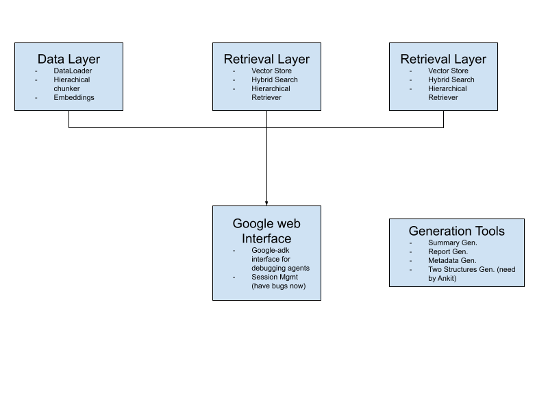

# Meeting Transcript RAG System

A sophisticated Retrieval-Augmented Generation (RAG) system designed for querying and analyzing meeting transcripts. The system implements hierarchical chunking, multi-agent query processing, and hybrid retrieval to provide accurate, context-aware answers to questions about meeting content.

## 🏗️ System Architecture

### Core Components




### Data Processing Pipeline

1. **Data Loading**: Loads meeting transcripts, metadata, summaries from `datademo/` directory
2. **Hierarchical Chunking**: Processes content at three levels (metadata, summary, meeting) with semantic-aware splitting and overlap preservation
3. **Embedding Generation**: Converts text chunks to vector embeddings using OpenAI's text-embedding models
4. **Vector Storage**: Stores embeddings in FAISS with hybrid search capabilities (vector similarity + BM25 keyword search)
5. **Index Persistence**: Saves FAISS indices and BM25 data structures for efficient retrieval

### Query Processing Flow

```
User Query → Query Rewriter → Hierarchical Retrieval → Answer Generation → Response
     ↓              ↓              ↓                      ↓
  Raw Text    Multi-Agent       Hybrid Search       Answer-Agent
             Processing       (Vector + BM25)       Generation
                             Score Fusion          Citations
```

## 🚀 Key Features

### Multi-Level Hierarchical Retrieval
- **Metadata Level**: Meeting overview, participants, topics, and keywords
- **Summary Level**: High-level meeting summaries with topic/action item references
- **Meeting Level**: Detailed topic and action item content with paragraph references

### Advanced Query Processing
- **Multi-Agent Query Rewriter**: Uses Google ADK agents for intelligent query normalization and paraphrasing
- **Session Management**: Maintains conversation context across multiple queries (have bugs, agents memory state have some issues)
- **Meeting Catalog Integration**: Provides temporal and participant context for query understanding

### Hybrid Search Technology
- **Vector Search**: Semantic similarity using OpenAI embeddings
- **BM25 Search**: Keyword-based retrieval for precise matching
- **Score Fusion**: Combines vector and BM25 scores for optimal ranking

### Web Interface & Agents
- **Google ADK Integration**: Advanced agent-based query processing
- **Session Management**: Persistent conversation context using Google ADK
- **REST API**: Programmatic access via `/api/query` endpoint
- **Health Monitoring**: System status and pipeline initialization checks

### Content Generation Tools
- **Structured Summaries**: Generate hierarchical meeting summaries with JSON and markdown output (Ankit need structure)
- **Detailed Reports**: Create comprehensive meeting reports with action items (Ankit need structure)
- **Metadata Generation**: Extract and structure meeting metadata
- **Meeting Level Processing**: Generate topic-level content breakdowns
- **Summary Level Processing**: Generate summary - level content breakdowns

## 📁 Project Structure

```
├── config/
│   ├── settings.py              # Configuration and API keys
│   └── requirements.txt         # Python dependencies
├── src/
│   ├── data_loader/
│   │   └── loader.py            # Meeting data loading and parsing
│   ├── chunking/
│   │   └── chunker.py           # Hierarchical text chunking
│   ├── embeddings/
│   │   └── generator.py         # OpenAI embedding generation
│   └── retrieval/
│       ├── vector_store.py          # FAISS + BM25 hybrid search
│       ├── vector_store_utils.py    # Vector store utilities
│       ├── hierarchical_retriever.py # Hierarchical retrieval logic
│       ├── rag_pipeline.py          # Main RAG pipeline orchestration
│       ├── orchestrator.py          # Query handling and session management
│       ├── query_rewriter_muti_agent.py    # Multi-agent query rewriting
│       ├── answer_generator_muti_agent.py  # Multi-agent answer generation
│       └── vector_store_es.py       # Elasticsearch vector store (alternative,not using now)
├── datademo/                    # Meeting data (con*/ directories)
├── vector_store/                # FAISS indices and BM25 data
│   ├── faiss/                   # FAISS vector indices
│   └── pickle/                  # Serialized BM25 and mapping data
├── generate/                    # Content generation scripts
│   ├── generate_summary.py          # Generate meeting summaries
│   ├── generate_structured_summary.py # Generate structured summaries (Ankit need)
│   ├── generate_detailed_report.py   # Generate detailed reports (Ankit need)
│   ├── generate_meetLevel.py         # Generate meeting level content
│   ├── generate_metaData.py          # Generate metadata
│   └── generate_transcript.py        # Generate transcripts
├── web_app/
│   └── agent.py                # Google ADK agent implementation, Google adk web interface
├── rag_main.py                 # Command-line interface
└── requirements.txt            # Project dependencies
```

## 🛠️ Installation & Setup

### Prerequisites
- Python 3.8+
- OpenAI API key (set in the environment)
- Google ADK credentials (for agent-based features)
- Elasticsearch (optional, for alternative vector storage)

### Environment Setup

1. **Clone and navigate to the project:**
   ```bash
   cd /path/to/your/project
   ```

2. **Create virtual environment:**
   ```bash
   python -m venv .venv
   # Windows
   .venv\Scripts\activate
   # Linux/Mac
   source .venv/bin/activate
   ```

3. **Install dependencies:**
   ```bash
   pip install -r requirements.txt
   ```

4. **Configure environment variables:**
   Create a `.env` file in the `config/` directory: (we already have one, but you need set your own config)
   
   ```env
   OPENAI_API_KEY=your_openai_api_key_here
   OPENAI_MODEL=gpt-4  # or gpt-3.5-turbo
   EMBEDDING_MODEL=text-embedding-3-small
   
   # Google ADK configuration (if using agent features)
   GOOGLE_ADK_PROJECT=your_google_cloud_project
   GOOGLE_ADK_LOCATION=your_location
   
   # Optional Elasticsearch configuration
   ELASTICSEARCH_URL=http://localhost:9200
   ELASTICSEARCH_USERNAME=your_username
   ELASTICSEARCH_PASSWORD=your_password
   ```

## 🚀 Usage

### Command Line Interface

**Initialize and run interactive mode:**
```bash
python rag_main.py
```

**Process a single query:**
```bash
python rag_main.py --query "What were the main action items from last week's meeting?"
```

**Advanced options:**
```bash
python rag_main.py --query "Who discussed the budget?" \
  --top-k-vector 10 \
  --top-k-bm25 30 \
  --verbose \
  --save-original-rank
```

### Content Generation Scripts

**Generate structured meeting summaries (Ankit need):**

```bash
# Generate summary for specific files
python generate/generate_structured_summary.py --start data001 --end data013

# Generate summary for single file
python generate/generate_structured_summary.py --start data014 --end data014
```

**Generate detailed meeting reports: (Ankit need)**

```bash
python generate/generate_detailed_report.py --start data001 --end data013
```


### Google ADK Integration

The system integrates with Google ADK for advanced agent-based query processing:

- **Agent-based Interface**: Uses Google ADK agents for intelligent query handling
- **Session Persistence**: Maintains conversation context across interactions
- **Very powerful framework**: https://google.github.io/adk-docs/

### API Usage (if available)

For programmatic access, the system can be integrated with Google ADK workflows or custom API endpoints.

## 🔧 Configuration

Key settings in `config/settings.py`:

```python
# Data and model configuration
DATA_DIR = PROJECT_ROOT / "datademo"
VECTOR_STORE_DIR = PROJECT_ROOT / "vector_store"
EMBEDDING_MODEL = "text-embedding-3-small"
OPENAI_MODEL = "gpt-4"

# Chunking parameters
CHUNK_SIZE = 800
CHUNK_OVERLAP = 120
ONLY_SUMMARY = True  # Focus on summary and meeting levels

# Retrieval parameters
TOP_K_VECTOR = 5    # Vector search results per query
TOP_K_BM25 = 20     # BM25 search results per query

# Session management (Google ADK)
APP_NAME = "agents"
USER_ID = "u-main"
TURN_SESSION_INITIAL_STATE = {}  # Initial session state
```

## 📊 Data Format

### Meeting Data Structure

Each meeting resides in a `datademo/conXXX/` directory with:

- **`metaDataXXX.json`**: Meeting metadata (participants, datetime, topics, etc.)
- **`dataXXX.md`**: Raw transcript with timestamped conversation
- **`meetLevelXXX.md`**: Topic-level structured summaries
- **`summaryXXX.md`**: High-level meeting summaries

### Hierarchical Content Levels

1. **Metadata Level**: Structured meeting information for quick filtering
2. **Summary Level**: Condensed meeting overviews with key takeaways
3. **Meeting Level**: Detailed topic and action item breakdowns

## 🧪 Testing & Evaluation
Will updated in the future

## 🔍 Advanced Features

### Multi-Agent Architecture

- **Query Rewriter**: Multi-agent system that normalizes queries, extracts entities, and generates paraphrases
- **Answer Generator**: Answer agent system that produces context-aware responses with citations
- **Session Service**: Google ADK-powered session management for conversation persistence
- **FullRAGSystemAgent**: Integrated Google ADK agent for complete RAG pipeline orchestration

### Hybrid Retrieval Strategy

The system combines multiple retrieval techniques:

1. **Query Rewriting**: Transforms user queries for better retrieval
2. **Multi-Query Search**: Searches with original query + paraphrases
3. **Hybrid Scoring**: Fuses vector similarity and BM25 keyword scores
4. **Hierarchical Ranking**: Prioritizes more relevant content levels

### Session Management

- **Turn-based Sessions**: Each query gets isolated session context
- **Memory Persistence**: Maintains conversation history across one turn (**long-term memory** will be generated in the future)

## 🚢 Deployment

### Production Deployment

**Using Gunicorn:**
```bash
gunicorn --config gunicorn_config.py web_app:app
```

**Docker deployment:**
```bash
# Build container
docker build -t rag-system .

# Run container
docker run -p 5000:5000 rag-system
```

this will be deployed on Amazon web console or Google, have not implement yet.

### Scaling Considerations

- **Vector Store**: FAISS for development now
- **Session Storage**: Google ADK session management with cloud persistence
- **Agent Orchestration**: Google ADK for scalable agent-based processing
- **API Rate Limiting**: Implement request throttling for OpenAI API calls

## 🤝 Contributing

1. Fork the repository
2. Create a feature branch
3. Make your changes with tests
4. Submit a pull request
5. Thanks to Astar IHPC

### Development Guidelines

- Follow the existing code structure and naming conventions
- Add unit tests for new components
- Update documentation for API changes
- Test with both command-line and web interfaces

## 📝 License

[Specify your license here]

## 📧 Contact

[Your contact information]

---

## 🔄 Recent Updates

- **Google ADK Integration**: Complete migration to Google ADK agent-based architecture
- **Multi-Agent Query Processing**: Enhanced query rewriting and answer generation with multiple specialized agents
- **Session Persistence**: Robust conversation context management using Google ADK
- **Content Generation Suite**: Comprehensive tools for structured summaries, detailed reports, and metadata generation
- **Hybrid Retrieval System**: Optimized vector + BM25 search with hierarchical ranking
- **Modular Architecture**: Clean separation of data loading, chunking, embedding, and retrieval components

For detailed implementation notes, see our development log: https://docs.google.com/document/d/1bM-uNABov4zaLEQbwsCUuPIePig0YhFNd4s-aKx46x4/edit?tab=t.0
